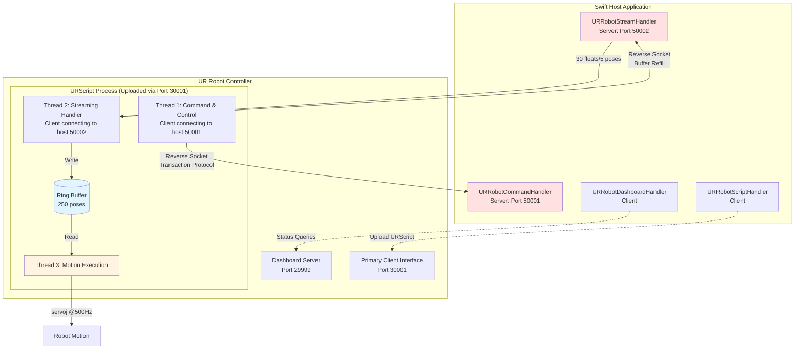

# Universal Robots (UR) Integration

## Architecture

### Socket Handlers

The UR robot integration uses multiple socket handlers located in `socketHandling/` to communicate with different interfaces:

#### URRobotScript (`socketHandling/URRobotScript/`)
- **Client-Host, Server-Robot** (Swift connects to robot)
- **Primary client interface** (port 30001 on robot)
- URScript upload and execution

#### URRobotDashboard (`socketHandling/URRobotDashboard/`)
- **Client-Host, Server-Robot** (Swift connects to robot)
- **Dashboard server** (port 29999 on robot)
- High-level robot state queries
- Safety and operational status
- See `URDashboardCommand.swift` for available commands

#### URRobotCommand (`socketHandling/URRobotCommand/`)
- **Client-Robot, Server-Host** (Robot connects to Swift via reverse socket)
- **Default port 50001** (on Swift host)
- Transaction-based command execution
- Discrete robot control operations (init, home, startstreaming, etc.)
- Created by URScript and connects back to host
- See `URCommand.swift` for available commands

#### URRobotStream (`socketHandling/URRobotStream/`)
- **Client-Robot, Server-Host** (Robot connects to Swift via reverse socket)
- **Default port 50002** (on Swift host)
- Buffer refill operations only (segmented from command/control)
- Connects to a ring buffer in URScript (see `Sources/SwiftRoboticAssets/Assets/UR/urScript.script`)
- High-frequency motion control via buffered streaming
- Supports waveform-based motion (example: `Sources/SwiftRoboticAssets/Assets/UR/streamRotateBase.json`)
- Specification: `Sources/SwiftRoboticAssets/Assets/UR/readme.md`

### Connection Workflow



**Key Points:**
- **Reverse Socket Pattern**: URScript on robot initiates connections to Swift host (ports 50001, 50002)
- **Standard Socket Pattern**: Swift connects to robot's standard UR interfaces (ports 29999, 30001)
- **Command Interface**: Transaction-based discrete commands (init, home, startstreaming, etc.)
- **Streaming Interface**: Custom buffer refill protocol using ring buffer for 500Hz motion control
- **Buffer Management**: 250-pose ring buffer (0.5s at 500Hz) with automatic refill at threshold
- **Motion Execution**: Independent thread consuming buffer at 500Hz using `servoj()`

## Validation in Simulator

To validate and test the UR robot integration, you can use the Universal Robots simulator via Docker.

### Docker Setup

Run the following command to start the UR e-series simulator:

```bash
docker run --rm -it \
  -p 5900:5900 \
  -p 6080:6080 \
  -p 29999:29999 \
  -p 30001:30001 \
  -p 30004:30004 \
  -p 50001:50001 \
  -p 50002:50002 \
  -v <path-to-your-programs-directory>:/ursim/programs \
  --platform=linux/amd64 \
  universalrobots/ursim_e-series
```

Replace `<path-to-your-programs-directory>` with the absolute path to your local programs directory.

### Port Mappings

- **5900**: VNC server
- **6080**: Web-based VNC client
- **29999**: Dashboard server
- **30001**: Primary client interface
- **30004**: Real-time client interface

### Accessing the Simulator

Once the container is running, you can access the simulator:
- Via web browser: `http://localhost:6080`
- Via VNC client: `localhost:5900`
