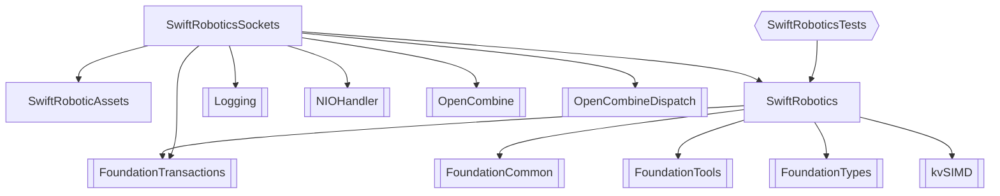

# SwiftRobotics

A Swift library for robotic manipulator kinematics, dynamics, and socket-based robot control. Runs on macOS and Linux (including NVIDIA Jetson).

## Layout



## Getting Started

### Building

```bash
swift build
```

### Running Tests

```bash
# Core kinematics tests (always available)
swift test --filter SwiftRoboticsTests

# Socket integration tests (requires URSim via Docker)
swift test --filter SwiftRoboticsSocketsTests
```

### Forward Kinematics

```swift
import SwiftRobotics

// Create a UR5e robot model
let robot = ManipulatorUR5e()

// Compute end-effector pose for a given joint configuration
let posture = PostureSerialRobot(jointAngles: [0, -Float.pi/2, Float.pi/2, 0, Float.pi/2, 0])
if let pose = robot.forwardKinematics(posture: posture) {
    print("End-effector position: \(pose.x), \(pose.y), \(pose.z)")
}
```

### Inverse Kinematics

```swift
import SwiftRobotics

let robot = ManipulatorUR5e()
var ikSolver = robot.inverseKinematics

let targetPose = PoseRobot(from4x4: desiredTransform)

// Use the typed result API for clear error handling
switch ikSolver.computeResultFor(pose: targetPose, whichPose: .shoulderLeftElbowUpWristDown) {
case .success(let postures):
    print("Joint angles: \(postures[0].jointAngles)")
case .outOfWorkspace:
    print("Target is outside the robot's reachable workspace")
case .singular:
    print("Target is at a wrist singularity")
case .noSolution:
    print("No IK solution found")
}
```

### Sending Commands to a UR Robot

```swift
import SwiftRoboticsSockets

// Connect to the robot's command socket (port 50001 by default)
let handler = URRobotCommandHandler()
handler.toggleConnection()

// Send built-in commands
handler.home()
handler.status()

// Send a custom command and observe the transaction
let transaction = handler.sendCommand(URRobotCommands("moveto", arguments: ["1.57", "-0.5", "0.0"]))
transaction.resultPublisher
    .sink { result in
        switch result {
        case .completed(let id, let response):
            print("Command \(id) completed: \(response ?? "")")
        case .failed(let id, let error):
            print("Command \(id) failed: \(error)")
        default: break
        }
    }
    .store(in: &cancellables)
```

## Installation
### Notes on GTK-4 for Linux UI

```
### Debian-based distros

sudo apt install libgtk-4-dev clang

# Fedora-based distros

sudo dnf install gtk4-devel clang
```

Installing the required dependencies on Debian-based and Fedora-based Linux distros

### Troubleshooting

If you run into errors related to not finding gtk/gtk.h when trying to build a swift-cross-ui project, try restarting your computer. This has worked in some cases (although there may be a more elegant solution).

If you are on a non-Debian non-Fedora distro and the GtkBackend requirements end up differing significantly from the requirements stated above, please open a GitHub issue or PR so that we can improve the documentation.
