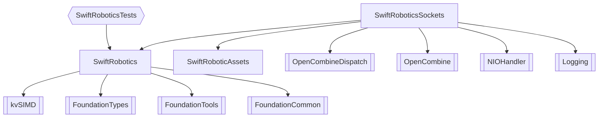

# Swift Robotics Code Base

## Layout



## Installation
### Notes on GTK-4 for Linux UI

```
### Debian-based distros

sudo apt install libgtk-4-dev clang

# Fedora-based distros

sudo dnf install gtk4-devel clang
```

Installing the required dependencies on Debian-based and Fedora-based Linux distros

### Troubleshooting

If you run into errors related to not finding gtk/gtk.h when trying to build a swift-cross-ui project, try restarting your computer. This has worked in some cases (although there may be a more elegant solution).

If you are on a non-Debian non-Fedora distro and the GtkBackend requirements end up differing significantly from the requirements stated above, please open a GitHub issue or PR so that we can improve the documentation.
